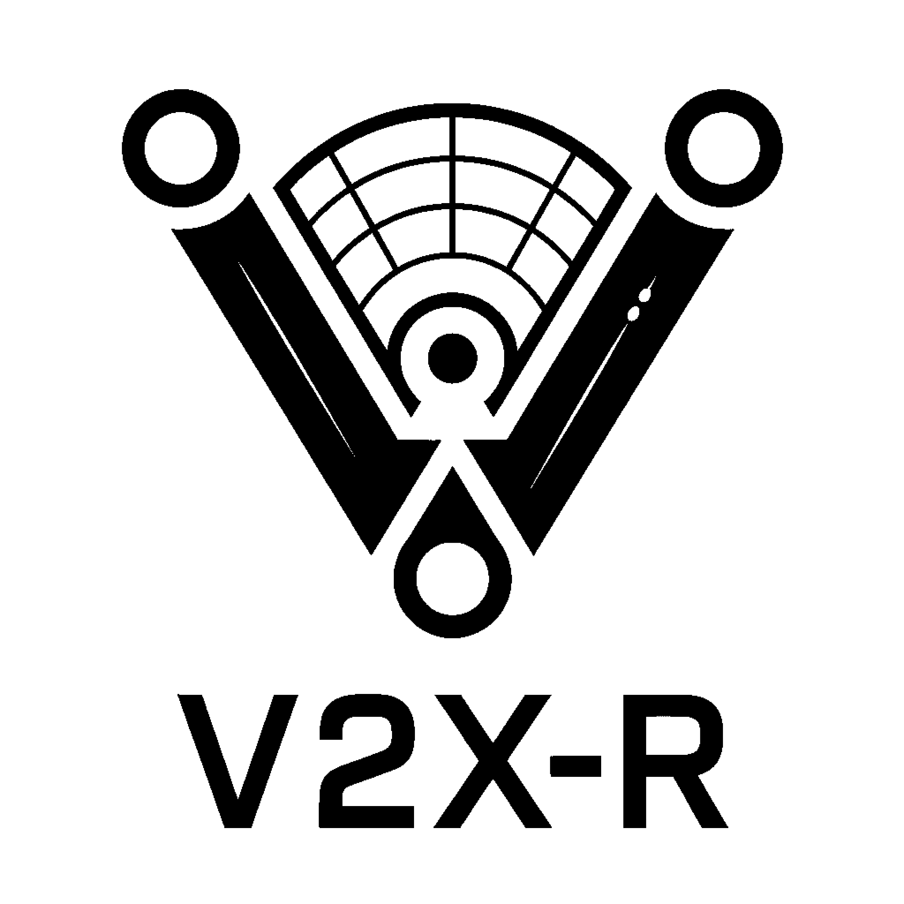
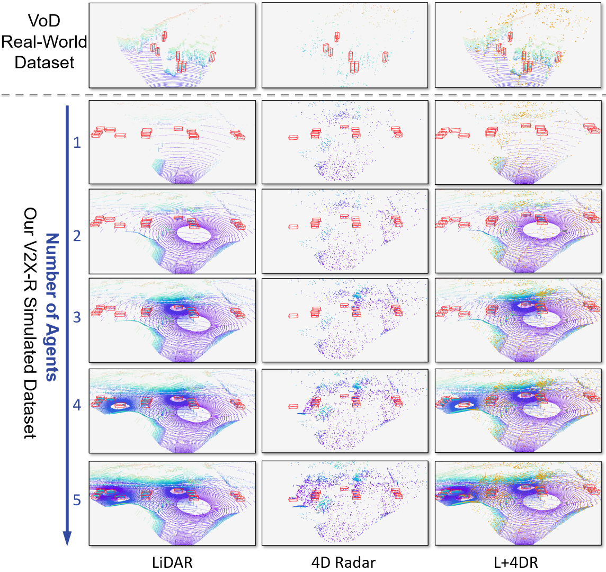

  

# V2X-R: Cooperative LiDAR-4D Radar Fusion for 3D Object Detection with Denoising Diffusion 

## Introduction
This is the official repository for the V2X-R, including the V2X-R dataset and the implementation of the benchmark model, and MDD module.  (coming soon)

## V2X-R Dataset Manual
The first simulated V2X dataset incorporating LiDAR, camera, and **4D radar**. V2X-R contains **12,079 scenarios** with **37,727 frames of LiDAR and 4D radar point clouds**, **150,908 images**, and **170,859 annotated 3D vehicle bounding boxes**.

  

## Installation

## Benchmark Models
### Performance
### Implementation 

## Training with MDD
